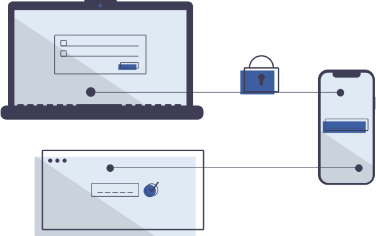

# How to Quickly Fix the 401 Error code?


After submitting an API call to Midtrans, it is possible to receive HTTP 401 Unauthorized error code response. This article discusses ways to troubleshoot a 401 (unauthorized) error code.

## What is the 401 Error Code?
The 401 (Unauthorized) error code indicates that the merchant server’s request was not verified. When accessing the Midtrans API, 
your backend sends a request, which in this case was not verified. You will receive a simple message telling you that the 
request is unauthorized, like the sample bellow.

<!-- tabs:start -->
#### **Response 401 Snap**
```json
{
   "error_messages": [
      "Access denied due to unauthorized transaction, please check client or server key",
      "Visit https://snap-docs.midtrans.com/#request-headers for more details"
   ]
}
```
#### **Response 401 Core API**

```json
{
   "status_code": "401",
   "status_message": "Transaction cannot be authorized with the current client/server key.",
   "id": "2e3d5c81-f80c-4aed-a40c-1298b4abfd93"
}
```
<!-- tabs:end -->

This means that an incorrect Server-Key/Client-Key are being used or server-key and client-key being used in the 
incorrect environment. In order to verify the request, you need to use it with valid server-key and client-key.

## How to Fix the 401 Error Code?

The 401 Unauthorized error can be fixed by using any of the following ways:

1. Check Server-Key and Client-Key: 
   - Ensure that the **server-key and client-key are being passed correctly**. Please copy directly the value of server-key and client-key [from Midtrans Dashboard.](/en/midtrans-account/overview.md#retrieving-api-access-keys) 
   - Ensure there are **no spaces** at the start or end of your server-key and client-key. 
   - Check that your Apps/Backend **authenticating for the correct environment**. The credentials for Sandbox and Production are unique.

2. Check The Endpoint API URL and Correct Environment:
   - Sandbox and production are separate environments. **Make sure that you are not mistakenly executing your request in the incorrect environment.**
   - **Use the correct URL for your environment**, See Sandbox base URLs and Production base URLs for more information.

<!-- tabs:start -->
#### **Base URLs**

#### Snap Endpoints URLs

The sample Base URLs for *Snap API* is given below. Choose your preferred environment on the "table" below.

| Environment | Method | URL                                                   |
| ----------- | ------ |-------------------------------------------------------|
| Sandbox     | POST   | `https://app.sandbox.midtrans.com/`                   |
| Production  | POST   | `https://app.midtrans.com/`                           |

#### Core API Endpoints URLs
The sample Base URLs for *Core API* is given below. Choose your preferred environment on the "table" below.

| Environment | Method | URL                                                   |
| ----------- | ------ |-------------------------------------------------------|
| Sandbox     | POST   | `https://api.sandbox.midtrans.com/` |
| Production  | POST   | `https://api.midtrans.com/`        |
<!-- tabs:end -->

We hope that the information in this guide has helped you fix the 401 error code. If you have any questions, tips, or further assistance required,  
please contact your Midtrans Business PIC or you can contact [Midtrans Contact Center](https://midtrans.com/contact-us/).
