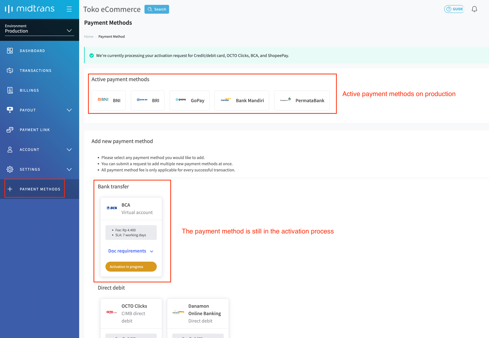
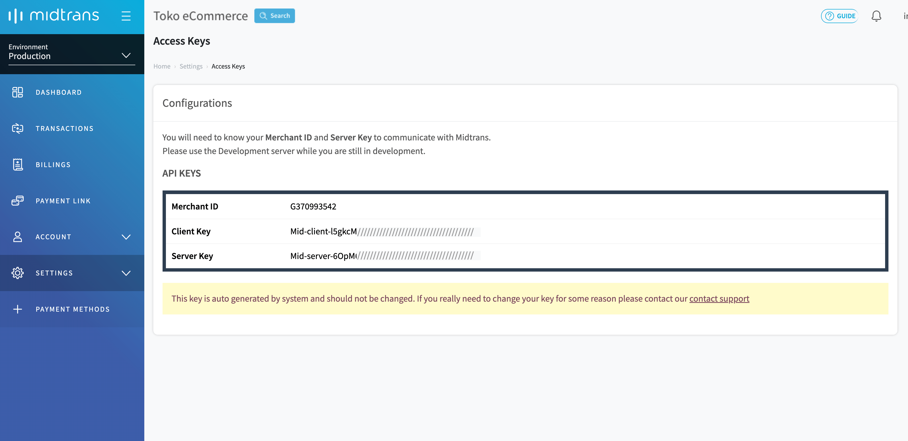

# Switching to Production Mode
<hr>

This document is designed to assist you in switching from *Sandbox* environment to *Production* environment, in order to start accepting real world payment for your business. This is also known as "Going Live".

?>Make sure you have already performed some successful [payment testing in the Sandbox environment](/en/technical-reference/sandbox-test.md), to ensure that your implementation is working properly.

## 1. Checking Your Production Account
To make sure that your Midtrans account already has activated payment method(s) on Production Environment mode, follow the steps given below.
1. Login to your Midtrans Administrative Portal using *Production* environment at https://dashboard.midtrans.com/login.
2. Go to menu **PAYMENT METHODS** from the dashboard page
    - *Active Payment Methods* page is displayed.
    - Then you can find a list of active payment methods ready in a production environment


<br>

In cases, you cannot access menu PAYMENT METHODS in the Midtrans Dashboard. You can also make sure your production account is active, by following the steps given below.

1. On the home page, go to **SETTINGS > SNAP PREFERENCES**.
   - *SNAP Preferences* page is displayed.
2. Select **Payment Channels** tab.
   - A list of active payment methods is displayed.

?>refer to [Access Midtrans Administration Portal](/en/midtrans-account/overview.md#accessing-midtrans-administration-portal) for more details.

## 2. Retrieving Production Server Key and Client Key
To switch from Sandbox to Production environment, Client Key and Server Key production are required.

To get access to the Client Key and Server Key, follow the steps given below.

1. Login to your Midtrans account.

2. On the *Dashboard*, go to **Settings > Access Keys**.

   *Access Keys* page is displayed.



## 3. Configuring the Integration

Please select which one of integration method you are using:

<!-- tabs:start -->
#### **Language Libraries**

If you are using Language Libraries provided by Midtrans (Midtrans PHP, Midtrans Ruby, Midtrans NodeJS, and so on), follow the steps given below.
#### On Backend

1. Replace `isProduction` variable on Backend with value `true`.
2. Replace `ServerKey` variable value on the Backend with the *Server Key* retrieved from [Step 2 above](#_2-retrieving-production-server-key-and-client-key).

#### On Frontend
<details open>
<summary>If you are using <b>Snap</b></summary>
<article>

Find where you include snap.js script tag:

- From script url, remove the `.sandbox`  to `https://app.midtrans.com/snap/snap.js`.
- Replace `data-client-key` attribute value with your production *Client Key*.
```html
<script type="text/javascript"
    src="https://app.midtrans.com/snap/snap.js"
    data-client-key="<INSERT-CLIENT-KEY>"></script>
```
</article>
</details>

<details>
<summary>If you are using <b>Core API</b></summary>
<article>
Find where you include midtrans-new-3ds.min.js script tag:

- Replace `data-environment` attribute value with `production`.
- Replace `data-client-key` attribute value with your production *Client Key*.
```html
<script id="midtrans-script" 
    src="https://api.midtrans.com/v2/assets/js/midtrans-new-3ds.min.js"
    data-environment="production" 
    data-client-key="<INSERT-CLIENT-KEY>" 
    type="text/javascript"></script>
```
</article>
</details>
<br>

#### **Manual API Request**

If you are directly integrating by direct API call/request:
#### On Backend
1. Replace API domain destination to Production API on Backend by removing `.sandbox` from the domain.
    - For example, change the API domain from `app.sandbox.midtrans.com/` to `app.midtrans.com/`.
2. Replace the `ServerKey` variable value used for API auth on the Backend with the *Server Key* retrieved from [Step 2 above](#_2-retrieving-production-server-key-and-client-key).

#### On Frontend
<details open>
<summary>If you are using <b>Snap</b></summary>
<article>

Find where you include snap.js script tag:

- From script url, remove the `.sandbox`  to `https://app.midtrans.com/snap/snap.js`.
- Replace `data-client-key` attribute value with your production *Client Key*.
```html
<script type="text/javascript"
    src="https://app.midtrans.com/snap/snap.js"
    data-client-key="<INSERT-CLIENT-KEY>"></script>
```
</article>
</details>

<details>
<summary>If you are using <b>Core API</b></summary>
<article>
Find where you include midtrans-new-3ds.min.js script tag:

- Replace `data-environment` attribute value with `production`.
- Replace `data-client-key` attribute value with your production *Client Key*.
```html
<script id="midtrans-script" 
    src="https://api.midtrans.com/v2/assets/js/midtrans-new-3ds.min.js"
    data-environment="production" 
    data-client-key="<INSERT-CLIENT-KEY>" 
    type="text/javascript"></script>
```
</article>
</details>
<br>

#### **WordPress WooCommerce**

1. Login to your website as an administrator.
2. Go to Midtrans plugin configuration page.
3. Go to **Settings > Payment**.
4. Select **Production** from Environment drop-down list.
5. Enter the **Merchant Key**.
6. Enter **Client Key** with the *Client Key* retrieved from [Step 2 above](#_2-retrieving-production-server-key-and-client-key).
7. Enter **Server Key** with the *Server Key* retrieved from [Step 2 above](#_2-retrieving-production-server-key-and-client-key).

Your website is now integrated with Midtrans. For more information, refer to [Configuring WooCommerce Plugin Notification](/en/snap/with-plugins.md).

#### **Magento**

1. Login to your website as an administrator.
2. Go to Midtrans plugin configuration page.
3. Go to **Sales > Payment Method**.
4. Select **Production** from Environment drop-down list.
5. Enter **Sandbox Client Key**.
6. Enter **Sandbox Server Key.**
7. Enter **Production Server Key** with the *Server Key* retrieved from [Step 2 above](#_2-retrieving-production-server-key-and-client-key).
8. Enter **Production Client Key** with the *Client Key* retrieved from [Step 2 above](#_2-retrieving-production-server-key-and-client-key).

Your website is now integrated with Midtrans. For more information, refer to [Configuring Magento CMS Notification](/en/snap/with-plugins.md).

#### **PrestaShop**

1. Login to your website as an administrator.
2. Go to the Midtrans plugin configuration page.
3. Select **Production** from Environment drop-down list.
4. Enter the **Merchant ID**.
5. Enter **Client Key** with the *Client Key* retrieved from [Step 2 above](#_2-retrieving-production-server-key-and-client-key).
6. Enter **Server Key** with the *Server Key* retrieved from [Step 2 above](#_2-retrieving-production-server-key-and-client-key).

Your website is now integrated with Midtrans. For more information, refer to [Configuring PrestaShop CMS Notification](/en/snap/with-plugins.md).

#### **OpenCart**

1. Login to your website as an administrator.
2. Go to the Midtrans plugin configuration page.
3. Enter the **Merchant Id**.
4. Select **Production** from Environment drop-down list.
5. Enter **Client Key** with the *Client Key* retrieved from [Step 2 above](#_2-retrieving-production-server-key-and-client-key).
6. Enter **Server Key** with the *Server Key* retrieved from [Step 2 above](#_2-retrieving-production-server-key-and-client-key).

Your website is now integrated with Midtrans. For more information, refer to [Configuring OpenCart CMS Notification](/en/snap/with-plugins.md).

#### **WordPress Easy Digital Download**

1. Login to your website as an administrator.
2. Go to the Midtrans plugin configuration page.
3. Go to **Settings > Payment Gateway > General**.
4. Enter the **Merchant ID**.
5. Enter **Production Server Key** with the *Server Key* retrieved from [Step 2 above](#_2-retrieving-production-server-key-and-client-key).
6. Enter **Production Client Key** with the *Client Key* retrieved from [Step 2 above](#_2-retrieving-production-server-key-and-client-key).
7. Enter **Sandbox Server Key.**
8. Enter **Sandbox Client Key**.

Your website is now integrated with Midtrans. For more information, refer to [Configuring WordPress Easy Digital Download CMS Notification](/en/snap/with-plugins.md).

#### **WHMCS**

1. Login to your website as an administrator.
2. Go to the Midtrans plugin configuration page.
3. Enter **Midtrans Client Key** with the *Client Key* retrieved from [Step 2 above](#_2-retrieving-production-server-key-and-client-key).
4. Enter **Midtrans Server Key** with the *Server Key* retrieved from [Step 2 above](#_2-retrieving-production-server-key-and-client-key).
5. Select **Production Mode** checkbox.
6. Click **Save Changes**.

Your website is now integrated with Midtrans. For more information, refer to [Configuring WHMCS CMS Notification](/en/snap/with-plugins.md).

#### **Drupal**

1. Login to your website as an administrator.
2. Go to the **Commerce > Configuration > Payment > Payment Gateways**.
3. Enter **name** this text appears on the button displayed to the customer.
4. Click **Midtrans** *Plugin* option button.
5. Click **Production** *Mode* option button.
6. Enter **Server key** with the *Server Key* retrieved from [Step 2 above](#_2-retrieving-production-server-key-and-client-key).
7. Enter **Client key** with the *Client Key* retrieved from [Step 2 above](#_2-retrieving-production-server-key-and-client-key).
8. Click **Save**.

Your website is now integrated with Midtrans. For more information, refer to [Configuring Drupal CMS Notification](/en/snap/with-plugins.md#drupal-plugin-notification-configuration).

<!-- tabs:end -->

## 5. Configuring HTTP Notification Webhooks URL

- For more information on how to configure HTTP notification URL, refer to [Configuring HTTP Notifications On MAP](/en/after-payment/http-notification.md).

- For **Snap Integration** you can opt to configure redirect URL. For more information, refer to [Configuring Redirect URL](/en/snap/advanced-feature.md#configuring-redirect-url).

## 6. Done! Ready for Production Mode

Now you are ready to accept real world payments in Production mode! You can test it yourself.

?> If further assistance is required, please contact your Midtrans Business PIC or you can contact [Midtrans Contact Center](https://midtrans.com/contact-us/).